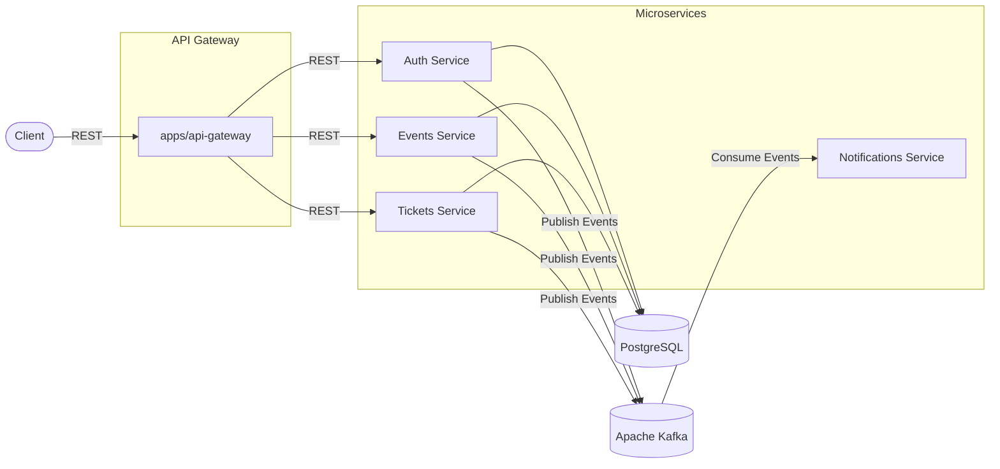
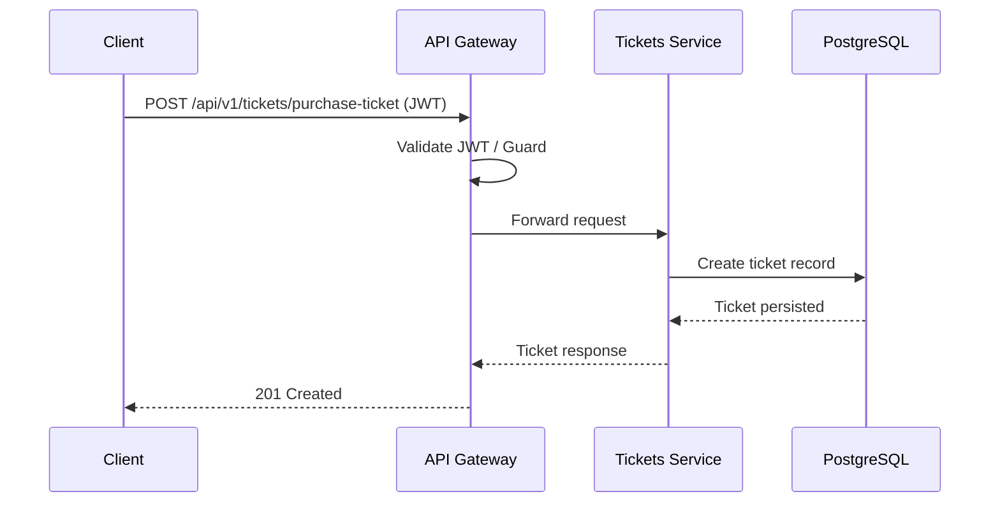
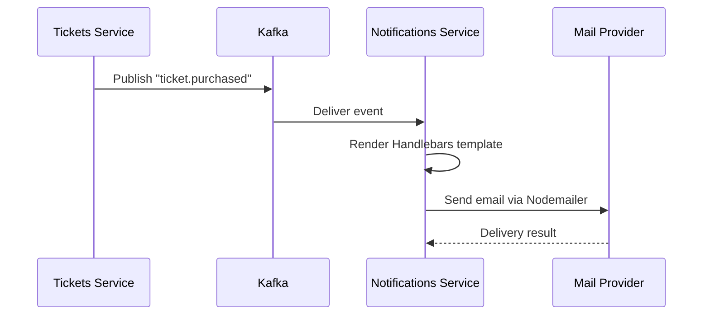

<div align="center">


# EventHub

### A Modern Event Ticketing Platform Built with Microservices

A production-inspired backend that enables user authentication, event management, ticket purchasing, attendee check-in, and asynchronous notifications using Apache Kafka.

[](https://nestjs.com/)
[](https://www.typescriptlang.org/)
[](https://www.postgresql.org/)
[](https://www.prisma.io/)
[](https://kafka.apache.org/)
[](https://www.docker.com/)
[](#license)

</div>

---

## Project Description

EventHub is a backend platform for managing events and ticket sales, designed around a **Microservices Architecture**. Users can register, create and publish events, purchase and cancel tickets, check in attendees at the door, and receive email notifications tied to their activity.

The system is organized as a **monorepo** with independently deployable NestJS services that communicate synchronously via REST (through an API Gateway) and asynchronously via **Apache Kafka**, with shared logic centralized in internal libraries. The goal of the architecture is scalability, clear separation of concerns, and maintainable service boundaries.

---

## Related Repository

- Frontend: [EventHub Frontend](https://github.com/gemmy404/eventhub-ui.git)

## Features

<table>
<tr>
<td valign="top" width="33%">

**Authentication**
- User registration
- Login
- JWT authentication
- Route protection (guards)
- Current user decorator

</td>
<td valign="top" width="33%">

**Events**
- Create event
- Update event
- Publish event
- Cancel event
- Browse events
- Event pagination
- Organizer authorization

</td>
<td valign="top" width="33%">

**Tickets**
- Purchase ticket
- Cancel ticket
- Ticket check-in
- Ticket ownership authorization
- Unique ticket codes

</td>
</tr>
</table>

**Notifications**
- Kafka consumers
- Email notifications
- Template-based emails (Handlebars)
- Event-driven notification processing

---

## Architecture

EventHub follows a **monorepo microservices** layout. Client requests enter through the API Gateway and are routed to the relevant service over REST. Apache Kafka is used for both **asynchronous event-driven communication** and **synchronous request/response communication between microservices**. Domain events (such as a ticket purchase or event cancellation) allow services like Notifications to react asynchronously, while request/response messaging allows services to retrieve required data without directly accessing another service's repository or database.



### Architectural Concepts

| Concept | Applied In |
|---|---|
| Microservices | Independent services under `apps/` |
| Monorepo | Shared `libs/` consumed by all services |
| Repository Pattern | Data access abstraction over Prisma |
| DTO Pattern | Request/response validation contracts |
| Mapper Pattern | Entity-to-DTO transformation |
| Event-Driven Architecture | Kafka producers/consumers for asynchronous domain events |
| Inter-Service Communication | Kafka request/response for synchronous service-to-service communication |
| Shared Libraries | `common`, `contracts`, `database`, `kafka` |
| Domain Contracts | `libs/contracts` |
| Guards | Route/ownership authorization |
| Decorators | `libs/common/decorators`, current-user extraction |
| Validation Pipes | `class-validator` / `class-transformer` |
| Exception Handling | Centralized error handling |
| Dependency Injection | NestJS module system throughout |

---

## Tech Stack

| Category | Technologies |
|---|---|
| Backend | Node.js, NestJS, TypeScript |
| Database | PostgreSQL, Prisma ORM |
| Messaging | Apache Kafka, KafkaJS |
| Authentication | JWT, Passport.js |
| Email | Nodemailer, MailerModule, Handlebars templates |
| Infrastructure | Docker, Docker Compose |
| Validation | class-validator, class-transformer |


---

## Microservices

| Service | Path | Responsibility |
|---|---|---|
| API Gateway | `apps/api-gateway` | Entry point for clients; routes REST requests to internal services; hosts `auth`, `events`, and `tickets` route modules |
| Auth Service | `apps/auth-service` | User registration, login, and JWT issuance |
| Events Service | `apps/events-service` | Event creation, publishing, updates, cancellation, and browsing |
| Tickets Service | `apps/tickets-service` | Ticket purchase, cancellation, and check-in |
| Notifications Service | `apps/notifications-service` | Consumes Kafka events and sends templated email notifications |

---

## Shared Libraries

<table>
<tr>
<th align="left">Library</th>
<th align="left">Purpose</th>
</tr>
<tr>
<td valign="top"><code>libs/common</code></td>
<td valign="top">
Cross-cutting utilities shared across all services: constants, decorators (e.g. current user), enums, guards, exception handlers, interfaces, and general-purpose utilities.
</td>
</tr>
<tr>
<td valign="top"><code>libs/contracts</code></td>
<td valign="top">
Defines shared domain contracts (DTOs and typed payloads) for <code>auth</code>, <code>common</code>, <code>events</code>, <code>pagination</code>, and <code>tickets</code>. Ensures API Gateway and services agree on request/response and Kafka message shapes.
</td>
</tr>
<tr>
<td valign="top"><code>libs/database</code></td>
<td valign="top">
Centralizes the Prisma schema, migrations, and a <code>PrismaService</code>/<code>PrismaModule</code> used by services that need database access, keeping the schema and client in one place.
</td>
</tr>
<tr>
<td valign="top"><code>libs/kafka</code></td>
<td valign="top">
Wraps Kafka producer/consumer setup behind a <code>KafkaModule</code> and <code>KafkaService</code>, with shared topic/constant definitions, so services publish and consume events consistently.
</td>
</tr>
</table>

---

## Folder Structure

```
eventhub/
├── apps/
│   ├── api-gateway/
│   │   ├── src/
│   │   │   ├── auth/
│   │   │   ├── events/
│   │   │   ├── tickets/
│   │   │   ├── app.module.ts
│   │   │   └── main.ts
│   │   └── tsconfig.app.json
│   ├── auth-service/
│   ├── events-service/
│   ├── notifications-service/
│   └── tickets-service/
├── libs/
│   ├── common/
│   │   ├── src/
│   │   │   ├── constants/
│   │   │   ├── decorators/
│   │   │   ├── enums/
│   │   │   ├── guards/
│   │   │   ├── handlers/
│   │   │   ├── interfaces/
│   │   │   ├── utils/
│   │   │   ├── common.module.ts
│   │   │   ├── common.service.ts
│   │   │   └── index.ts
│   │   └── tsconfig.lib.json
│   ├── contracts/
│   │   ├── src/
│   │   │   ├── auth/
│   │   │   ├── common/
│   │   │   ├── events/
│   │   │   ├── pagination/
│   │   │   ├── tickets/
│   │   │   ├── contracts.module.ts
│   │   │   ├── contracts.service.ts
│   │   │   └── index.ts
│   │   └── tsconfig.lib.json
│   ├── database/
│   │   ├── prisma/
│   │   │   ├── migrations/
│   │   │   └── schema.prisma
│   │   ├── src/
│   │   │   ├── index.ts
│   │   │   ├── prisma.module.ts
│   │   │   └── prisma.service.ts
│   │   └── tsconfig.lib.json
│   └── kafka/
│       ├── src/
│       │   ├── constants/
│       │   ├── index.ts
│       │   ├── kafka.module.ts
│       │   └── kafka.service.ts
│       └── tsconfig.lib.json
├── docs/
│   └── assets/
│       └── logo.svg
├── .env
├── .gitignore
├── .prettierrc
├── docker-compose.yml
├── eslint.config.mjs
├── LICENSE
├── nest-cli.json
├── package.json
├── package-lock.json
├── README.md
├── tsconfig.build.json
└── tsconfig.json
```

---

## API Flow

A typical synchronous request (e.g. purchasing a ticket) flows through the gateway to the owning service:



---

## Event Flow

Domain actions are published to Kafka so downstream services can react without direct coupling. Notifications, for example, consumes events to send emails:



---

## Installation

<details>
<summary><strong>Prerequisites</strong></summary>

- Node.js
- Docker and Docker Compose
- PostgreSQL (or use the provided Docker service)
- Apache Kafka broker (or use the provided Docker service)

</details>

```bash
# Clone the repository
git clone https://github.com/gemmy404/eventhub.git
cd eventhub

# Install dependencies
npm install
```

---

## Environment Variables

Create a `.env` file at the project root:

```env
# Database
DB_HOST=
POSTGRES_USER=
POSTGRES_PASSWORD=
POSTGRES_DB=
DB_PORT=
DATABASE_URL=

# Kafka
KAFKA_BROKER=

# JWT
JWT_ACCESS_TOKEN_SECRET=
JWT_ACCESS_TOKEN_EXPIRATION_MS=

# Mail
MAIL_HOST=
MAIL_PORT=
MAIL_USER=
MAIL_PASS=
```

| Variable | Description |
|---|---|
| `DB_HOST` | PostgreSQL host |
| `POSTGRES_USER` | PostgreSQL username |
| `POSTGRES_PASSWORD` | PostgreSQL password |
| `POSTGRES_DB` | PostgreSQL database name |
| `DB_PORT` | PostgreSQL port |
| `DATABASE_URL` | Full Prisma connection string |
| `KAFKA_BROKER` | Kafka broker address |
| `JWT_ACCESS_TOKEN_SECRET` | Secret used to sign access tokens |
| `JWT_ACCESS_TOKEN_EXPIRATION_MS` | Access token expiration (ms) |
| `MAIL_HOST` | SMTP host |
| `MAIL_PORT` | SMTP port |
| `MAIL_USER` | SMTP username |
| `MAIL_PASS` | SMTP password |

---

## Running with Docker

```bash
# Build and start all services
docker-compose up --build

# Run in detached mode
docker-compose up -d

# Stop services
docker-compose down
```

---

## Running Locally

<details>
<summary><strong>Run a service without Docker</strong></summary>

```bash
# Apply database migrations
npx prisma migrate dev --schema=libs/database/prisma/schema.prisma

# Start a specific service in watch mode
npm run start:dev <service-name>

# Example
npm run start:dev api-gateway
```

</details>

---

## Available Services

| Service | Default Purpose |
|---|---|
| API Gateway | Public HTTP entry point |
| Auth Service | Handles registration and login |
| Events Service | Manages event lifecycle |
| Tickets Service | Manages ticket purchase and check-in |
| Notifications Service | Sends event-driven email notifications |

---

## License

This project is licensed under the MIT License. See the [LICENSE](LICENSE) file for details.